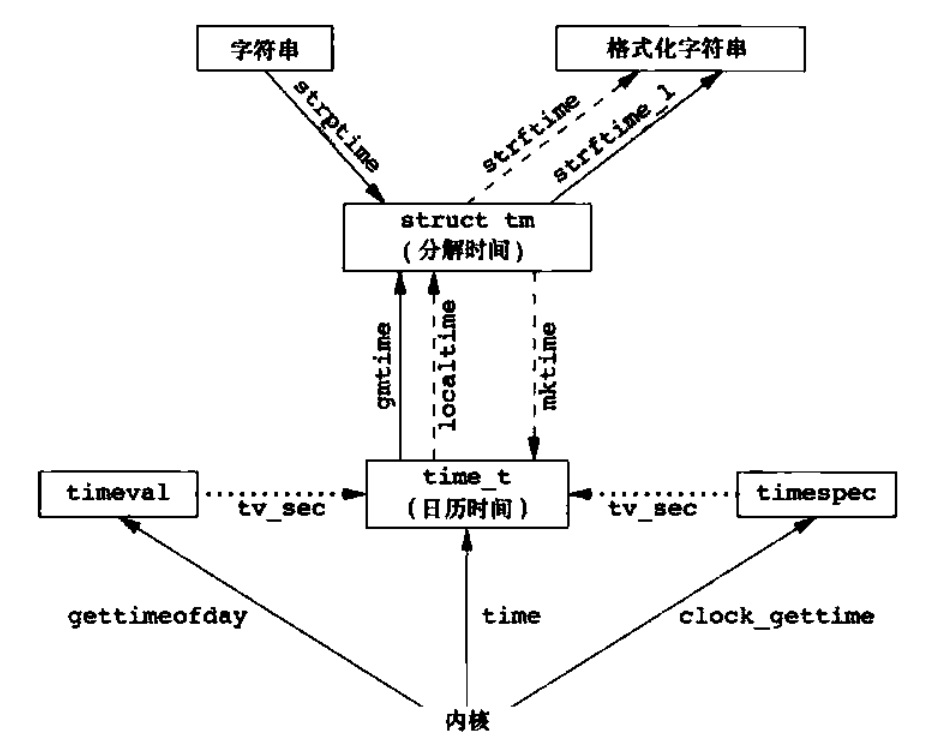

# Linux 系统编程笔记

- 课程视频：[Linux 系统编程 - 李慧琴老师](https://www.bilibili.com/video/BV1yJ411S7r6)
  - 深入浅出，点面结合，恪守标准，爆赞
- 参考书目
  - UNIX 环境高级编程（第三版）
  - Linux 内核设计与实现（第三版）
  - 深入理解 Linux 内核（第三版）
- 参考文章
  - [Linux系统编程学习笔记 | 来生拓己 オフィシャルサイト](https://kisugitakumi.net/2022/11/20/Linux系统编程学习笔记/)

## 标准 I/O

### 简介

- I/O：input & output
- stdio：标准 I/O（优先使用，因为可移植性好且封装性好）
- sysio：系统 I/O（也叫文件 I/O）

常见标准 I/O：

| 打开/关闭文件 | 输入输出流          | 文件指针操作 | 缓存相关 |
| ------------- | ------------------- | ------------ | -------- |
| fopen         | fgetc，fputc        | fseek        | fflush   |
| fclose        | fgets，fputs        | ftell        |          |
|               | fread，fwrite       | rewind       |          |
|               | printf 族，scanf 族 |              |          |

FILE 类型始终贯穿标准 I/O

### fopen

```c
FILE *fopen(const char *path, const char *mode)
```

- path：文件路径
- mode：访问权限
  - r：只读，文件指针定位到文件开头，要求文件必须存在
  - r+：可读写，文件指针定位到文件开头，要求文件必须存在
  - w：只写，有此文件则清空，无此文件则创建文件，文件指针定位到文件开头
  - w+：可读写，有此文件则清空，无此文件则创建文件，文件指针定位到文件开头
  - a：只写，追加到文件，无此文件则创建文件，文件指针定位到文件末尾（最后一个字节的下一个位置）
  - a+：可读可追加（可写），无此文件则创建文件，读文件加时文件指针定位到文件开头，追加时文件指针定位到文件末尾
  - b：以二进制流打开，可以在以上权限后面加此权限（遵循 POSIX 的系统可以忽略，包括 Linux）
- 若执行成功函数返回一个 FILE 指针，失败则返回 NULL 并设置全局变量`errno`
  - `errno`的定义在 `/usr/include/asm-generic`的宏中，若想使用需包含`errno.h`
  - `perror()`可以输出易读的`errno`信息，包含在`stdio.h`中
  - `strerror()`可以返回一个易读的`errno`信息的字符串，包含在`string.h`中
- 优秀的编码规范：const 指针表明函数不会改变路径或访问权限

新建出的文件的权限（RWX，通过`ls -l`查看的那个）

- 公式：`0666 & ~umask`（若创建的是目录则为`0777 & ~umask`）
- 公式中的数字全是八进制数
- umask（权限掩码）是用户创建的文件的默认权限，可以使用`umask`指令查看
- 可见，umask 越大，创建的文件的权限越少
- umask 在`/etc/profile`中有定义：UID 大于 199 的用户默认为 002（文件 664、目录 775），其他用户默认为 022（文件 644、目录 755）

### fclose

```c
int fclose(FILE *fp);
```

* 若执行成功函数返回 0，失败则返回 EOF（一般是 -1，也会有例外）并设置`errno`
* 如果文件是输出流，则会表现为先刷新缓冲区再关闭文件

为什么要有`fclose()`？因为实际上`fopen()`内隐含了一个`malloc()`，故打开的文件内存位于堆中；同理，`fclose()`需隐含一个`free()`来释放内存

Linux 会对文件描述符的数量进行限制，可以通过`ulimit -n`命令查看，超过限制数则会弹出`too many open files`警告，每个用户的文件数目上限可以在`/etc/security/limits.conf`中修改
在默认情况下至多可以打开 3 + 1021 = 1024 个文件，上限可修改的极限为 1024 * 1024 = 1048576

### fgetc、fputc

```c
int fgetc(FILE *stream);
int getc(FILE *stream);
int getchar(void);
```

这三个函数若执行成功则返回读到的 unsigned char 强转 int，失败或读到文件尾则返回 EOF

`getchar()`等价于`getc(stdin)`
`getc()`等价于`fgetc()`，但`getc()`是由宏来实现的，而`fgetc()`是正常的函数实现，相对而言宏实现编译更慢运行更快

```c
int fputc(int c, FILE *stream);
int putc(int c, FILE *stream);
int putchar(int c);
```

`putchar(c)`等价于`putc(c, stdout)`
同上，`putc()`等价于`fputc()`，区别是宏实现与函数实现

#### 例程：实现 cp 指令

```c
#include <stdio.h>
#include <stdlib.h>
 
int main(int argc, char **argv){
    FILE *fps, *fpd;
    int ch;

    if(argc < 3){
        fprintf(stderr, "Usage:%s <src_file> <dest_file>\n", argv[0]);
        exit(1);
    }
    
    fps = fopen(argv[1], "r");
    if(fps == NULL){
        perror("fopen()");
        exit(1);
    }
    fpd = fopen(argv[2], "w");
    if(fps == NULL){
        fclose(fps);
        perror("fopen()");
        exit(1);
    }

    while(1){
        ch = fgetc(fps);
        if(ch == EOF){
            break;
        }
        fputc(ch, fpd);
    }
    
    fclose(fpd);
    fclose(fps);
    return 0;
}
```


### fgets、fputs

```c
char *fgets(char *s, int size, FILE *stream);
char *gets(char *s);
```

`gets`是危险的，建议使用`fgets()`

`fgets()`接收 stdin 时会在读到`\n`或读到 size - 1 时补上`\0`并停止
函数成功时返回串的指针，失败或读到文件末尾或未接收到任何字符则返回空指针
易错点：假设不停调用`fgets()`，输入 size - 1 个字符加换行会先在读到 size - 1 时结束然后在读到`\n`时再结束一次）

```c
int fputs(const char *s, FILE *stream);
int puts(const char *s);
```

### fread、fwrite

二进制流/文件流的输入输出

```c
size_t fread(void *ptr, size_t size, size_t nmemb, FILE *stream);
size_t fwrite(const void *ptr, size_t size, size_t nmemb, FILE *stream);
```

- `fread()`：ptr 从 stream 读 nmemb 个对象，每个对象的大小为 size 字节
- `fwrite()`：ptr 向 stream 写 nmemb 个对象，每个对象的大小为 size 字节
- 读写数量以对象为单位，若文件剩余字节数不足以读写一个对象则会直接结束
- 函数返回已读写的对象数，执行失败或读到文件尾则返回 0

#### 修改例程 mycp

用`fread()`和`fwrite()`代替`fgetc`和`fputc`

```c
char buf[SIZE];
···
while((n = fread(buf, 1, SIZE, fps)) > 0)
	fwrite(buf, 1, n, fpd);
```

### printf 族、scanf 族

```c
int printf(const char *format, ...);
int fprintf(FILE *stream, const char *fromat, ...);
int sprintf(char *str, const char *format, ...);
int snprintf(char *str, size_t size, const char *format, ...);
```

- `printf`：将格式化串输出到 stdout
- `fprintf`：将格式化串输出到 stream 中，可以用于实现重定向
- `sprintf`：将格式化串输出到串中
  - 示例：`sprintf(str, "%d + %d = %d", 1, 2, 3);`->`str == "1 + 2 = 3"`
  - `atoi`：字符串转整数，如："123456" -> 123456、"123a456" -> 123
- `snprintf`：带对象数限制的`sprintf`

```c
int scanf(const char *format, ...);
int fscanf(FILE *stream, const char *fromat, ...);
int sscanf(char *str, const char *format, ...);
```

- `scanf`、`fscanf`：同上
- `sscanf`：按照格式化串将串内容输入变量中
  - 示例：
    `strcpy(dtm, "Saturday March 25 1989");`
    `sscanf(dtm, "%s %s %d %d", weekday, month, &day, &year);`
  - 结果：`printf("%s %d, %d = %s\n", month, day, year, weekday);`->`March 25, 1989 = Saturday`

### fseek、ftell

```c
int fseek(FILE *stream, long offset, int whence);
long ftell(FILE *stream);
void rewind(FILE *stream);
```

- `fseek`：将文件指针位置设置到相对`whence`偏移`offset`处，执行成功返回 0
  - `whence`：文件开头`SEEK_SET`、文件指针当前位置`SEEK_CUR`、文件末尾`SEEK_END`（正负偏移是允许的）
  - 文件读写会导致文件指针的移动，此时常使用`fseek`重新定位文件指针
- `ftell`：返回文件指针当前位置
- `rewind`：等价于`(void)fseek(stream, 0L, SEEK_SET)`，即将文件指针设置到文件开始处

```c
int fseeko(FILE *stream, off_t offset, int whence);
off_t ftell(FILE *stream);
```

- 由于历史原因，此前设计选用的 long 类型只能支持 2G 以内的文件，无法满足现代系统的文件大小，故用 off_t 类型支持更大的文件（off_t 大小各系统不同，64 bit Linux 中是 64 位），编译时加上`_FILE_OFFSET_BITS`宏可以修改 off_t 大小，
- 仅 POSIX 支持，C89、C99 不支持（即所谓方言）

### fflush

```c
int fflush(FILE *stream);
```

- 将缓冲区刷新到文件流中，若 stream 为 NULL 则会刷新打开的所有文件

stdout 是行缓冲模式，只在遇到`\n`、`\0`或行满时才会刷新输出流

示例

```c
printf("before");
while(1);
printf("after");
```

以上情况无输出，因为 stdout 未被刷新

```c
printf("before\n");
while(1);
printf("after\n");
```

或

```c
printf("before");
fflush(stdout);
// or fflush(NULL);
while(1);
printf("after");
```

则可以正常输出 "before"，因为两种方式都刷新了 stdout

关于缓冲区：

- 缓冲区是在内存中一块指定大小的存储空间，用于临时存储 I/O 数据
- 作用：合并系统调用、实现数据块复用、缓和 CPU 与 I/O 设备的速度差异
- 模式：
  - 行缓冲：换行、满时或强制刷新时刷新（如 stdout）
  - 全缓冲：满时刷新或强制刷新（默认，只要不是终端设备）
  - 无缓冲：立即输出（如 stderr）
- 强制刷新时换行符仅是一个字符，无刷新功能
- 进程结束时也会强制刷新
- 更改缓冲区：（了解即可）
  - `int setvbuf(FILE *stream, char *buf, int mode, size_t size);`
  - buf：分配给用户的缓冲，NULL 时自动分配默认大小
  - mode：无缓冲`_IONBF`、行缓冲`_IOLBF`、全缓冲`_IOFBF`

### getline

```c
#define _GNU_SOUECE
#include <stdio.h>

ssize_t getline(char **lineptr, size_t *n, FILE *stream);
```

- lineptr：指向存放字符串行的指针，若为 NULL 则由操作系统 malloc（由于是动态分配内存，所以串的指针值很可能会因 realloc 而产生变化，故这里采用二级指针），使用完函数记得 free 掉曾使用的内存
- n：指定缓冲区的大小，若为系统自行 malloc 则填 0
- `getline`会生成从输入流读入的一整行字符串，在文件结束、遇到定界符或达到最大限度时结束生成字符串，成功执行则返回读到的字符数（包括回车符等定界符，但不包括`\0`），失败则返回 -1
- `getline`依旧不被标准 C 支持，但 POSIX 和 C++ 支持
- `getline`可以动态地调整缓冲区大小，这是此前函数不支持的
- `_GNU_SOUECE`宏建议在 Makefile 中添加，但其实现代编译器已经默认支持该宏

示例

```c
int main(int argc, char **argv) {
    FILE *fp;

    char *linebuf = NULL;
    size_t linesize = 0;
    
    if(argc < 2) {
        fprintf(stderr, "Usage...\n");
    }
    
    fp = fopen(argv[1], "r");
    if(fp == NULL) {
        perror("fopen()");
        exit(1);
    }
    
    while(1) {
    	if(getline(&linebuf, &linesize, fp) < 0)
            break;
       	printf("%d\n", strlen(linebuf));
    }
    
    fclose(fp);
    exit(0);
}
```

局部变量使用前一定要初始化
进程结束会自动释放内存，故这里没有手动 free 掉

### 临时文件

```c
char *tmpnam(char *s);
FILE *tmpfile(void);
```

- `tmpnam`会生成并返回一个有效的临时文件名
  - s 为存放文件名的字符串，创建文件名成功会将其返回，若 s 为 NULL 则指向缓冲区，其会在下一次调用函数时被覆盖
  - 函数存在并发问题，多线程下不做处理有可能产生两个甚至更多同名临时文件，造成覆盖
- `tmpfile`会产生一个匿名文件
  - 以 w+b 模式创建临时文件，失败将返回 NULL
  - 匿名文件不可见，但在磁盘中，同样有文件描述符和打开计数器等
  - 在被关闭或进程结束时匿名文件会被自动删除

## 系统调用 I/O

### 文件描述符

- 设计`open`函数打开一个文件的过程中必然会产生一个结构体（文件表项）来描述这个文件，这个结构体记录了包括 inode、引用计数在内的文件操作信息（类似于 FILE 结构体），这些结构体的地址会被存放在进程内部的一个数组中，而文件描述符 fd 实际上就是这个数组的索引
- 文件描述符是整型的，但`ulimit`会限制一个用户可打开的文件数量，默认 1024
- `fopen`内部实际上也调用了`open`，区别在于`fopen`只能打开流式文件，而`open`能打开设备文件等
- 每个进程都有自己的描述符表（但会共享一个操作系统维护的文件表），负责记录进程打开的所有文件
- 文件描述符会优先选择最小的空位，一个文件可以有多个描述符
- 调用`close`时会将引用计数减 1，如果此时引用计数为 0 则释放文件

### open、close

```c
#include <sys/types.h>
#include <sys/stat.h>
#include <fcntl.h>

int open(const char *pathname, int flags);
int open(const char *pathname, int flags, mode_t mode);
```

- flags 和 mode 都是以位图形式表示的，就是 kernel 代码里那种或一大堆宏名然后用掩码提取的形式
- `open`是变参函数。变参和 C++ 重载的区别在于变参函数在编译时不会限制传入参数的数量（不报错不代表是正确写法）但重载会严格限制所定义的参数个数；最典型的变参函数就是`printf`
- flags：包含必需访问模式和可选模式，用按位或运算串联
  - 必需：只读`O_RDONLY`、只写`WRONLY`、读写`O_RDWR`
  - 可选：可分为创建选项和状态选项两大类，数量庞大故不详细列出，常用如下
    - 创建`O_CREAT`、确保创建不冲突`O_EXCL`、追加`O_APPEND`、文件长度置零`O_TRUNC`、非阻塞模式打开`O_NONBLOCK`（默认以阻塞模式打开文件）
  - 对比`fopen`：
    - `r == O_RDONLY`
    - `r+ == O_RDWR`
    - `w == O_WRONLY | O_CREAT | O_TRUNC`
    - `w+ == O_RDWR | O_CREAT | O_TRUNC`
- mode：搭配`O_CREAT`使用，同样是用按位或运算串联，主要规定各种权限

```c
#include <unistd.h>

int close(int fd);
```

- 返回 0 表示执行成功，-1 表示失败（一般认为不会执行失败）

### read、write、lseek

```c
#include <unistd.h>

ssize_t read(int fd, void *buf, size_t count);
```

- 从文件 fd 中取出前 count 字节放入缓冲区 buf 中
- 执行成功返回实际读取的字节数，错误返回 -1

```c
#include <unistd.h>

ssize_t write(int fd, const void *buf, size_t count);
```

- 从缓冲区 buf 读取前 count 字节写入文件 fd 中
- 执行成功返回实际读取的字节数，错误返回 -1

```c
#include <sys/types.h>
#include <unistd.h>

off_t lseek(int fd, off_t offset, int whence);
```

- 设置文件位置指针为从 whence 开始的偏移 offset
- whence 可取：
  - `SEEK_SET`：开头
  - `SEEK_END`：末尾
  - `SEEK_CUR`：当前位置

#### 例程：使用 read、write 实现 mycp

```c
#include <stdio.h>
#include <stdlib.h>
#include <sys/types.h>
#include <sys/stat.h>
#include <fcntl.h>
#include <unistd.h>

#define BUFSIZE 1024

int main(int argc, char **argv)
{
    int sfd, dfd;
    char buf[BUFSIZE];
    int len, ret, pos;

    if (argc < 3)
    {
        fprintf(stderr, "Usage:%s <src_file> <dest_file>\n", argv[0]);
        exit(1);
    }

    if ((sfd = open(argv[1], O_RDONLY)) < 0)
    {
        perror("open()");
        exit(1);
    }
    if ((dfd = open(argv[2], O_WRONLY | O_CREAT | O_TRUNC, 0600)) < 0)
    {
        close(sfd);
        perror("open()");
        exit(1);
    }

    while (1)
    {
        if ((len = read(sfd, buf, BUFSIZE)) < 0)
        {
            perror("read()");
            break;
        }
        if (len == 0)
            break;

        pos = 0;
        while (len > 0)
        {
            if ((ret = write(dfd, buf + pos, len)) < 0)
            {
                perror("write()");
                exit(1);
            }
            pos += ret;
            len -= ret;
        }
    }

    close(dfd);
    close(sfd);

    exit(0);
}
```

- 毕竟是系统编程，现在开始模仿 kernel 的编码风格
- 在`write`处引入`pos`的原因是防止`write`提前返回导致实际写入的数量少于`len`（比如磁盘空间不足、阻塞的系统调用被信号打断）
- 而不在`read`处不引入`pos`的原因则是文件大小可能小于`BUFSIZE`

### 系统 I/O 与标准 I/O、I/O 效率

系统 I/O（文件 I/O）与标准 I/O 的区别

- 系统 I/O 没有缓存，操作对象是文件描述符`fd`指向的文件结构体，对文件的读写是面向磁盘的，响应速度快但吞吐量小、系统调用频繁
- 标准 I/O 设有缓存，操作对象是封装了文件描述符`fd`以及其他内容的`FILE`结构体，操作往往基于缓存，响应速度慢但吞吐量大
- 相对而言大吞吐量会使用户的使用体验更好，但不是越大越好
  - 可以用 time 命令查看程序执行的总时间（real）、用户态时间（user）和内核态时间（sys）

建议多使用标准 I/O 而少使用文件 I/O
由于 cache 的原因，两者混用会导致同步问题，如果不得不混用可以用以下函数互转

```c
int fileno(FILE *stream);
FILE *fdopen(int fd, const char *mode);
```

示例

```c
#include <stdio.h>
#include <stdlib.h>
#include <unistd.h>

int main() {
    putchar('a');
    write(1, "b", 1);

    putchar('a');
    write(1, "b", 1);

    putchar('a');
    write(1, "b", 1);

    exit(0);
}
```

- 预期输出是`ababab`，但实际输出是`bbbaaa`
- 通过`strace`可以跟踪系统调用
  - 三个`write(1, "b", 1)`被立即执行
  - 三个`putchar('a')`是在最后才通过一个`write(1, "aaa", 3)`一次性输出

### truncate、ftruncate

```c
int truncate(const char *path, off_t length);
int ftruncate(int fd, off_t length);
```

- 两个函数都用于截短文件长度
  - `trunacte`：截短路径为 path 发文件
  - `ftruncate`：截短已通过文件 I/O 打开的文件

### dup、dup2、原子操作

```c
#include <unistd.h>

int dup(int oldfd);
int dup2(int oldfd, int newfd);
```

- `dup`将文件`oldfd`复制到当前最小的空闲文件描述符并返回之
- `dup2`关闭`newfd`（如果已打开）并将文件`oldfd`复制到`newfd`并返回`newfd`，如果`newfd`与`oldfd`相等则不执行操作并返回`newfd`，与`dup`不同的是`dup2`是原子的
- 以上两个函数并不会关闭`oldfd`，需要手动关闭，若调用`dup2`则关闭时需要注意判断`newfd`与`oldfd`是否相等
- 像这样的操作需要考虑更多情况：
  - 操作的原子性
  - 关闭文件在本线程完成需求后其他线程是否还会使用（线程之间文件描述符是共享的）

### fcntl、ioctl、/dev/fd

```c
#include <unistd.h>
#include <fcntl.h>

int fcntl(int fd, int cmd, ... /* arg */);
```

- 以前种种文件操作实际上都是使用`fcntl`通过不同的`cmd`实现的
  - 复制一个已有的描述符：`F_DUPFD`或`F_DUPFD_CLOEXEC`
  - 获取/设置文件描述符标志：`F_GETFD`或`F_SETFD`
  - 获取/设置文件状态标志：`F_GETFL`或`F_SETFL`
  - 获取/设置异步I/O所有权：`F_GETOWN`或`F_SETOWN`
  - 获取/设置记录锁：`F_GETLK`、`F_SETLK`或`F_SETLKW`
- 成功执行返回值依赖于`cmd`，失败则返回 -1

```c
#include <sys/ioctl.h>

int ioctl(int d, int request, ...)
```

- 种种设备操作实际上都是使用`ioctl`实现的
- 由于 Linux 需要对各种设备进行支持，`ioctl`极其杂乱庞大

对于每个进程，内核都会提供一个虚目录`/dev/fd`，进程打开的文件的文件描述符对应其中的文件`/dev/fd/n`中的编号 n
所以以下函数功能是等价的

```c
fd = open("/dev/fd/1", O_WRONLY);
// is equal to
fd = dup(1)
```

## 文件系统

### 简介

#### Linux 目录树


- `/bin`：bin 是 Binaries 的缩写，这个目录存放着最经常使用的命令对应的二进制可执行文件
- `/boot`：这里存放的是启动 Linux 时使用的一些核心文件，包括一些连接文件以及 kernel 镜像文件
- `/dev` ：dev 是 Device(设备) 的缩写，该目录下存放的是 Linux 的外部设备，在 Linux 中访问设备的方式和访问文件的方式是相同的（一切皆文件）
- `/etc`：etc 是 Etcetera 的缩写，这个目录用来存放所有的系统管理所需要的配置文件和子目录
  - `/etc/passwd`：记载了用户信息，格式为`[user name]:"x":[uid]:[gid]:[description]:[home dir]:[default shell]`
  - `/etc/shadow`：基本与`/etc/passwd`一致，区别在于 "x" 换成了密码的哈希值与加密时加的盐
  - `/etc/group`：记载了用户组信息，格式为`[group name]:[group password]:[gid]:[group user]`
- `/home`：用户的主目录，每个用户都有一个自己的目录，一般该目录名是以用户的账号命名
- `/lib`：lib 是 Library 的缩写这个目录里存放着系统最基本的动态连接共享库
- `/lost+found`：这个目录一般情况下是空的，当系统非法关机后，这里就存放了一些文件
- `/media`：Linux 系统会自动识别一些设备，例如U盘、光驱等等，当识别后，Linux 会把识别的设备挂载到这个目录下
- `/mnt`：系统提供该目录是为了让用户临时挂载别的文件系统的，我们可以将光驱挂载在 /mnt/ 上，然后进入该目录就可以查`看光驱里的内容了`
- `/opt`：opt 是 Optional 的缩写，这是给主机额外安装的用户级第三方软件所摆放的目录，默认是空的
- `/proc`：proc 是 Processes 的缩写，这是一种虚拟文件系统，存储的是当前内核运行状态的一系列特殊文件，这个目录是一个虚拟的目录，它是系统内存的映射，我们可以通过直接访问这个目录来获取系统信息
- `/root`：root 用户的主目录
- `/sbin`：s 就是 Super User 的意思，是 Superuser Binaries 的缩写，这里存放的是系统管理员使用的系统管理程序
- `/tmp`：tmp 是 Temporary 的缩写这个目录是用来存放一些临时文件的
- `/usr`：usr 是 Unix Shared Resources 的缩写（不是 User，这个经常搞错），这是一个非常重要的目录，用户的很多应用程序和文件都放在这个目录下，类似于 windows 下的 C:/Windows/ 目录
  - `/usr/lib`：可以理解为 C:/Windows/System32
  - `/usr/local`：用户级的程序目录，可以理解为 C:/Progrem Files/，用户自己编译的软件默认会安装到这个目录下
  - `/usr/include`：存放了系统编程是所需的头文件
- `/var`：var 是 Variable 的缩写，这个目录中存放着在不断扩充着的东西，我们习惯将那些经常被修改的目录放在这个目录下，包括各种日志文件
- `/run`：是一个临时文件系统，存储系统启动以来的信息。当系统重启时，这个目录下的文件应该被删掉或清除

#### inode


inode 结构体包含文件的属性信息有以下内容：

- 文件的字节数

- 文件拥有者的 id
- 文件所属组 id
- 文件的读写执行权限
- 文件的时间戳，共有三个：
  - ctime 指inode上一次变动的时间
  - mtime 指文件内容上一次变动时间
  - atime 指文件上一次打开时间
- 硬链接数，即有多少个文件指向这个 inode
- 文件数据块（block）的位置，即指向数据块的指针，包括一级指针，二级指针和三级指针，一般为15个指针

inode 中没有记载文件名和 inode 编号。inode 也会消耗硬盘空间，所以硬盘格式化的时候，操作系统自动将硬盘划分为两个区域：一个是数据区，存放文件数据，另一个是 inode 区（inode table），存放 inode 所包含的信息，inode 区本质上是一个结构体数组，数组下标就是 inode 编号`inode_num`


当系统在找一个文件时，步骤如下：

- 通过文件名先找到文件的 inode 编号（数组下标）

- 通过 inode 编号找到文件 inode 结构体获取文件信息
- 通过 inode 结构体中的 block 指针找到文件内容

### stat

```c
#include <sys/types.h>
#include <sys/stat.h>
#include <unistd.h>

int stat(const char *path, struct stat *buf);
int fstat(int fd, struct stat *buf);
int lstat(const char *path, struct stat *buf);
```

- 此三个系统调用用于获取文件属性信息
- `stat`和`fstat`获取文件信息并写入缓冲区 buf，对于软链接文件则获取软链接指向的原文件的信息
- `lstat`对于软链接文件则获取此文件本身信息，其余与上面一致
- 成功执行返回 0，失败返回 -1 并设置 errno

`stat`结构体定义如下

```c
struct stat {
    dev_t     st_dev;         /* ID of device containing file */
    ino_t     st_ino;         /* Inode number */
    mode_t    st_mode;        /* File type and mode */
    nlink_t   st_nlink;       /* Number of hard links */
    uid_t     st_uid;         /* User ID of owner */
    gid_t     st_gid;         /* Group ID of owner */
    dev_t     st_rdev;        /* Device ID (if special file) */
    off_t     st_size;        /* Total size, in bytes */
    blksize_t st_blksize;     /* Block size for filesystem I/O */
    blkcnt_t  st_blocks;      /* Number of 512B blocks allocated */

    /* Since Linux 2.6, the kernel supports nanosecond
       precision for the following timestamp fields.
       For the details before Linux 2.6, see NOTES. */

    struct timespec st_atim;  /* Time of last access */
    struct timespec st_mtim;  /* Time of last modification */
    struct timespec st_ctim;  /* Time of last status change */

#define st_atime st_atim.tv_sec      /* Backward compatibility */
#define st_mtime st_mtim.tv_sec
#define st_ctime st_ctim.tv_sec
};
```

- `off_t`类型在 32 位机器上 gcc 会编译为`long int`，在 64 位机器上则会编译为`long long int`，具体可以查看`unistd.h`中的定义

  ```c
  # ifndef __off_t_defined
  #  ifndef __USE_FILE_OFFSET64
  typedef __off_t off_t;
  #  else
  typedef __off64_t off_t;
  #  endif
  #  define __off_t_defined
  # endif
  # if defined __USE_LARGEFILE64 && !defined __off64_t_defined
  typedef __off64_t off64_t;
  #  define __off64_t_defined
  # endif
  ```

注意到`stat`结构体中有三个域

```c
off_t     st_size;        /* Total size, in bytes */
blksize_t st_blksize;     /* Block size for filesystem I/O */
blkcnt_t  st_blocks;      /* Number of 512B blocks allocated */
```

- 块大小一般为 4096 字节
- `st_size`是文件的逻辑大小
- `st_blksize * st_block`是文件的物理大小，其值不一定等于`st_size`

`lseek`允许将文件偏移移动到超过文件长度的位置，倘若将文件偏移移动到超过文件大小的位置再写入内容，将会拓展文件的逻辑大小，并在前文件结尾与当前写入位置之间产生一个文件空洞，这种文件就叫做空洞文件。文件空洞部分在被写入实际内容前不会被分配物理空间，但会被算入文件的逻辑大小`st_size`、

空洞文件的一个作用是多线程文件操作，对于一个大文件我们可以先创建一个文件空洞并进行多线程分段写入，这比单线程更高效。比如`BitTorrent`协议多线程下载时就可以先创建一个空洞文件，再分配多个线程分别从不同地址下载并写入其负责的文件块

对于`/proc`伪文件系统中的大部分文件`stat`函数和命令都不会返回其`st_size`域，故返回值默认为 0。这在旧版 man 手册中有所提及（应该是旧版，目前机器上的 man 手册已经找不到这段了，但实验证明其`st_size`域依旧只返回 0。贴个链接：[stat(2): file status - Linux man page (die.net)](https://linux.die.net/man/2/stat)）

> For most files under the */proc* directory, **stat**() does not return the file size in the *st_size* field; instead the field is returned with the value 0.

而如果将其中的空文件复制到一个实际的文件系统中则会重新体现其物理文件大小

```shell
$ cp /proc/stat /tmp/stat
$ stat /proc/stat
  文件：/proc/stat
  大小：0               块：0          IO 块大小：1024   普通空文件
设备：16h/22d   Inode：4026532034  硬链接：1
权限：(0444/-r--r--r--)  Uid: (    0/    root)   Gid: (    0/    root)
访问时间：2023-10-05 20:38:34.847999991 +0800
修改时间：2023-10-05 20:38:34.847999991 +0800
变更时间：2023-10-05 20:38:34.847999991 +0800
创建时间：-
$ stat /tmp/stat
  文件：/tmp/stat
  大小：6034            块：16         IO 块大小：4096   普通文件
设备：10302h/66306d     Inode：38535194    硬链接：1
权限：(0444/-r--r--r--)  Uid: ( 1000/   asuka)   Gid: ( 1000/   asuka)
访问时间：2023-10-22 11:15:57.871455090 +0800
修改时间：2023-10-22 11:15:57.871455090 +0800
变更时间：2023-10-22 11:15:57.871455090 +0800
创建时间：2023-10-22 11:15:57.871455090 +0800
```

`st_mode`是一个 16 位的位图，记录了文件的权限信息和部分文件属性信息


- 黏着位（`S_ISVTX`）曾被用于在进程退出时将文件保存在 swap 分区中以加速下次启动进程，此功能已经在现代系统中废除，如今的功能是限定文件仅允许属主与 root 删除，典型应用就是`/tmp`目录，`t`位即为黏住位的体现

  ```shell
  drwxrwxrwt  52 root root  12K 10月 22 11:32 tmp
  ```

### FAT 文件系统、UFS 文件系统

内容太多，以后另开文章

### 链接文件

链接文件有硬链接与符号链接（不是软链接）

硬链接可以由`ln`指令创建，但不能为分区和目录创建硬链接

硬链接文件本身不会创建新的`iNode`，而是在父目录文件中创建一个指向原文件的目录项来实现的。由于硬链接文件与源文件共享`iNode`与数据块，对任意一方的修改操作都会影响另一方，但删除操作只会减少文件的链接数，直到链接数为 0 才算真正从文件系统中删除文件，链接数可以在`stat`结构体中的`st_nlink`域中体现

```c
nlink_t   st_nlink;       /* Number of hard links */
```

`link`函数可以用于创建硬链接

```c
#include <unistd.h>

int link(const char *oldpath, const char *newpath);
```

`unlink`函数可以删除一个文件的目录项并减少它的链接数，执行成功则返回 0，否则返回 -1 并设置 errno

```c
#include <unistd.h>

int unlink(const char *pathname);
```

符号链接可以使用`ln -s`命令创建，与硬链接不同的之处是不能为分区和目录创建硬链接，但可以创建符号链接

符号链接与硬链接不同，其会切实创建一个内容为目标路径的文件，类似于 Windows 里的“快捷方式”，删除原文件后链接文件依旧存在，但会变为非法链接

### 常用文件操作

```c
#include <stdio.h>

int remove(const char *pathname);
int rename(const char *oldpath, const char *newpath);
```

- `remove`：即`rm`
- `rename`：即`mv`，重命名即是`mv [old_filename] [new_filename]`

```c
#include <sys/types.h>
#include <utime.h>

int utime(const char *filename, const struct utimbuf *times);
```

- `uname`：更改文件最后读时间与最后修改时间，不是很常用

```c
#include <unistd.h>

int chdir(const char *path);
int fchdir(int fd);
```

- `chdir`：即`cd`，更改程序的工作路径
- `fchdir`：将工作目录更改到`fd`打开的目录处

```c
#include <unistd.h>

char *getcwd(char *buf, size_t size);
char *getwd(char *buf);
char *get_current_dir_name(void);
```

- `getcwd`：即`pwd`
- `getwd`：旧版的`getcwd`，有缓冲区溢出的风险故不推荐使用
- `get_current_dir_name`：无需考虑缓冲区大小的`getcwd`，由于使用`malloc`动态分配内存故要记得用完释放
  - 是不是感觉函数命名风格很突兀，因为这是 GNU extension

### glob、目录解析

```c
#include <glob.h>

int glob(const char *pattern, int flags,
         int (*errfunc) (const char *epath, int eerrno),
         glob_t *pglob);
void globfree(glob_t *pglob);
```

- `glob`：解析模式串，将结果存放到`pglob`结构体中，执行成功返回 0，失败按失败原因返回特定的宏值
  - `pattern`：将要解析的路径的模式串，支持通配符（不是正则匹配）
  - `flags`：解析模式
  - `errfunc`：错误处理函数，解析失败就会调用该函数
  - `pglob`：指向存放解析结果的结构体
- `globfree`：释放`glob`申请的空间

`pglob`结构体定义如下

```c
typedef struct {
	size_t   gl_pathc;    /* Count of paths matched so far  */
	char   **gl_pathv;    /* List of matched pathnames.  */
	size_t   gl_offs;     /* Slots to reserve in gl_pathv.  */
} glob_t;
```

- 可以看到其设计非常像`argc`、`**argv`，解析结果时也应当依赖于这些参数

### 目录函数

打开/关闭目录

```c
#include <sys/types.h>
#include <dirent.h>

DIR *opendir(const char *name);
DIR *fdopendir(int fd);
int closedir(DIR *dirp);
```

- `opendir`、`fdopendir`：打开目录文件，结果指向堆区
- `closedir`：关闭打开的目录文件，释放占用的内存

读目录文件

```c
#include <dirent.h>

struct dirent *readdir(DIR *drip);
```

- `readdir`：循环遍历打开的目录，执行成功返回记录目录项信息的`dirent`结构体指针，失败返回 NULL

`dirent`结构体定义如下

```c
struct dirent {
	ino_t          d_ino;       /* Inode number */
	off_t          d_off;       /* Not an offset; see below */
	unsigned short d_reclen;    /* Length of this record */
	unsigned char  d_type;      /* Type of file; not supported
	                               by all filesystem types */
	char           d_name[256]; /* Null-terminated filename */
};
```

- `d_off`本应是指目录项在目录文件中的偏移，但现代文件系统中很少会体现目录偏移量，故 man 手册不建议对它做任何假设并使用它

还有一些其他目录函数，与文件操作函数类似，这里不一一展开讲解

- `void rewinddir(DIR *dp)`：将读取位置回溯到开头
- `long int telldir(DIR *dp)`：返回当前读取位置距离起始位置的偏移量
- `void seekdir(DIR *dp, long int loc)`：设置读取位置到距离起始位置`loc`处

## 系统数据文件与信息

### 用户信息

获取用户信息

```c
#include <sys/types.h>
#include <pwd.h>

struct passwd *getpwnam(const char *name);
struct passwd *getpwuid(uid_t uid);
```

- 函数根据用户名或 uid 来获取用户信息，并返回一个`passwd`结构体，这些信息与`/etc/passwd`文件中的记录一致

`passwd`结构体定义如下

```c
struct passwd {
	char   *pw_name;       /* username */
	char   *pw_passwd;     /* user password */
	uid_t   pw_uid;        /* user ID */
	gid_t   pw_gid;        /* group ID */
	char   *pw_gecos;      /* user information */
	char   *pw_dir;        /* home directory */
	char   *pw_shell;      /* shell program */
};
```

用户组信息

```c
#include <sys/types.h>
#include <grp.h>

struct group *getgrnam(const char *name);
struct group *getgrgid(gid_t gid);
```

- 根据用户组名或 gid 来获取用户组信息，返回一个`group`结构体，与`/etc/group`信息一致

`group`结构体定义如下

```c
struct group {
	char   *gr_name;        /* group name */
	char   *gr_passwd;      /* group password */
	gid_t   gr_gid;         /* group ID */
	char  **gr_mem;         /* NULL-terminated array of pointers
                               to names of group members */
};
```

### 口令

获取口令信息

```c
#include <shadow.h>

struct spwd *getspnam(const char *name);
```

- 通过用户名获取`/etc/shadow`内对应用户的信息，并返回一个`spwd`结构体
  - 只有 root 用户能正确执行包含此函数的程序

`spwd`结构体定义如下

```c
struct spwd {
	char *sp_namp;     /* Login name */
	char *sp_pwdp;     /* Encrypted password */
	long  sp_lstchg;   /* Date of last change
                          (measured in days since
                          1970-01-01 00:00:00 +0000 (UTC)) */
	long  sp_min;      /* Min # of days between changes */
	long  sp_max;      /* Max # of days between changes */
	long  sp_warn;     /* # of days before password expires
                          to warn user to change it */
	long  sp_inact;    /* # of days after password expires
                          until account is disabled */
	long  sp_expire;   /* Date when account expires
                          (measured in days since
                          1970-01-01 00:00:00 +0000 (UTC)) */
	unsigned long sp_flag;  /* Reserved */
};
```

口令加密

```c
#include <crypt.h>

char *crypt(const char *phrase, const char *setting);
```

这里与 APUE 有所出入（新旧版用法相同），旧版 man 手册介绍如下

```c
#define _XOPEN_SOURCE
#include <unistd.h>

char *crypt(const char *key, const char *salt);
```

- `phrase`域（``key`域）就是要加密的字符串
- `setting`域（`salt`域）指定加密方式与盐或其他加密相关内容
  - setting 串以`$`符号划分加密方式选项和对应的参数，参数个数与选择的加密方式有关，形式为`$id$xx$...$xx$`
    - 以 SHA-512 为例，其形式为`$id$salt$`
    - 下面先按 SHA-512 来讲解
  - `id`用于指定 hash 方法，1 是 MD5，5 是 SHA-256，6 是 SHA-512，y 是 yescrypt，还有一些其他的方法
    - 现在的 Linux 中都默认使用 yescrypt 或 SHA-512 来对用户口令进行加密，这在`/etc/shadow`中有所体现
  - `salt`就是要加的盐
- 函数返回一个字符串，同样以`$`符号划分拼接传入的 setting 串和加密结果，其形式与`/etc/shadow`一致
- 编译时需要加参数`-lcrypt`链接`libcrypt`库

### 时间与日期

APUE 总结的各个时间函数的关系如下



```c
#include <time.h>

time_t time(time_t *t);
```

- 成功执行则返回从 UTC 1970 年 1 月 1 日开始至今的时间（单位为秒）并将结果存放到`t`中，失败则返回 -1 的强转`((time_t) -1)`并设置 errno

```c
#include <time.h>

struct tm *gmtime(const time_t *timep);
struct tm *gmtime_r(const time_t *timep, struct tm *result);

struct tm *localtime(const time_t *timep);
struct tm *localtime_r(const time_t *timep, struct tm *result);

time_t mktime(struct tm *tm);
```

- `gmtime`按 UTC 时间将`time_t`时间戳转换为`tm`结构体，`localtime`则按本地时区转换
- `mktime`按本地时区将`tm`结构体转换为`time_t`时间戳

`tm`结构体定义如下

```c
struct tm {
	int tm_sec;    /* Seconds (0-60) */
	int tm_min;    /* Minutes (0-59) */
	int tm_hour;   /* Hours (0-23) */
	int tm_mday;   /* Day of the month (1-31) */
	int tm_mon;    /* Month (0-11) */
	int tm_year;   /* Year - 1900 */
	int tm_wday;   /* Day of the week (0-6, Sunday = 0) */
	int tm_yday;   /* Day in the year (0-365, 1 Jan = 0) */
	int tm_isdst;  /* Daylight saving time */
};
```

上面的时间信息依旧不够丰富，`strftime`函数可以按指定的格式化字符串来定制化生成时间信息

```c
#include <time.h>

size_t strftime(char *s, size_t max, const char *format, const struct tm *tm);
```

- `s`：存放结果的缓冲区
- `max`：缓冲区长度
- `format`：格式化字符串，占位符如下
  - 
- `tm`：要解析的`tm`结构体

## 进程环境

### 进程终止

进程终止有多种可能的情形，在编码时都应该考虑完全

- 正常终止
  - 从`main`返回
  - 调用`exit`
  - 调用`_exit`或`_Exit`
  - 最后一个线程从其启动例程返回
  - 最后一个线程调用`pthread_exit`
- 异常终止
  - 调用`abort`
  - 接到一个信号并终止
  - 最后一个线程对取消请求做出响应

进程结束时会将其`main`的返回值返回给其父进程。若父进程是 shell，程序的返回值可以使用`echo $?`查看

关于程序退出的函数之间的关系如下


- `_exit`和`_Exit`与`exit`的区别是前两者是系统函数，不会对进程资源做任何清理；而后者是系统函数的包装，会负责执行终止处理程序并释放进程资源

程序可以注册至多 32 个终止处理程序（exit handler），`exit`函数被调用时就会去执行这些函数，终止处理程序的注册需要使用`atexit`

```c
#include <stdlib.h>

int atexit(void (*function)(void));
```

- 当程序正常终止时`exit`会调用`atexit`注册的无参无返回值的函数，成功注册则返回 0，反之返回非零值

### 命令行参数

我们通常会在命令行中为程序传入选项，POSIX 定义了相关的解析函数来解析 POSIX 风格的命令行参数

```c
#include <unistd.h>

int getopt(int argc, char * const argv[], const char *optstring);

extern char *optarg;
extern int optind, opterr, optopt;
```

- `getopt`：根据参数选项字符串`optstring`解析命令行参数，成功解析一个选项则返回该选项，解析到选项参数则返回 1，全部成功解析返回 -1，反之返回`?`
  - `optsrting`格式规则：
    - 单个字符表示该选项不需要额外参数
    - 字符接一个冒号表示该选项需要一个参数，参数传入时可以与紧跟选项或以空格隔开，此参数的首地址将赋值给指针`optarg`
    - 字符接两个冒号表示该选项的参数可选，若有参数则必须紧跟选项
    - 举例：`ab:c`的合法命令行参数可以为`-a -b value -c`或`-ac -bvalue`
  - 由于函数会遍历并返回解析到的字符，所以一般搭配循环和`switch`使用
- `optarg`：指向选项参数的指针
- `optind`：argv 当前索引值
- `opterr`：无效选项信息，初始为 0
- `optopt`：出现无效选项时为无效选项的索引值
- 此外还有适合于解析长选项的函数`getopt_long`和`getopt_long_only`，这里不展开

### 环境变量

环境变量本质是一系列 kv 键值对，可以在 shell 中使用`export`命令查看系统环境变量，`env`命令查看当前用户环境变量，`echo $key`可以查看指定 key 的 value；`export key=value`或直接修改配置文件可以设置或添加环境变量，重新登陆或执行`source`命令使配置生效

系统环境变量文件：

- `/etc/profile`：系统的环境变量和启动脚本或程序，对所有用户生效
- `/etc/profile.d/`：该目录下的脚本和程序会在用户登录时被执行
- `/etc/bashrc`：对所有用户生效的 bash 环境变量文件

用户环境变量文件处于 home 目录中，以 bash 为例：

- `.bash_profile`：不一定默认存在，当用户登录时执行，每个用户都可以使用该文件来配置专属于自己的环境变量
- `.bashrc`：当用户登录时以及每次打开新的 shell 时该文件将被读取，每开一个 shell 该文件都会被读取一次，可能影响效率
- `.bash_logout`：当每次退出系统 shell 时执行该文件
- `.bash_history`：保存了当前用户使用过的历史命令

在程序执行时，环境变量位于栈区底部（高地址处）

对每个程序而言，其都拥有一张字符指针形式的环境表，可以使用环境指针`extern char **environ`来访问环境表


环境表相关函数

```c
#include <stdlib.h>

char *getenv(const char *name);
int setenv(const char *name, const char *value, int overwrite);
int unsetenv(const char *name);

extern char **environ;
```

- `getenv`：根据 key 来获取对应环境变量值
- `setenv`：设置指定 key 的环境变量，若`overwrite`为 1 则表示修改现有的环境变量
  - 原来的环境变量算是处于栈区，到程序执行时键值对长度已经固定，故若修改的新值比原值短则直接截断，比原值长则会在堆中申请一段内存用于存放新值，并修改环境表项指针指向这片内存
- `unsetenv`：删除指定 key 的环境变量
- `environ`：环境表指针，当做字符指针数组来使用就行

### 共享库

用于在运行时装卸、使用共享库

```c
#include <dlfcn.h>

void *dlopen(const char *filename, int flags);
int dlclose(void *handle);
void *dlsym(void *handle, const char *symbol);
char *dlerror(void);
```

- 编译时需要加上参数`-ldl`
- `dlopen`：打开一个新共享库并加载进内存，返回一个`void`指针（称为 handle）
  - ld.so 会去主动搜索`/lib`和`/usr/lib`
  - `flags`是加载选项，比如`RT_LAZY`选项表示延迟加载直到库函数被调用
- `dlclose`：卸载 handle 对应的共享库
- `dlsym`：解析共享库中对应名字的函数地址并返回
  - 由于返回值是`void`指针，而`void`指针强转是未定义行为，man 手册中特别提及以下两种用
    - `(type (*)(arg_type)) dlsym(handle, "func_name")`：这种写法更直观，但涉及未定义行为（虽然已经写进新的 man 手册）
    - `*(void **) (&func_ptr) = dlsym(handle, "func_name")`：这种写法不便于阅读，单能保证编译行为一致
- `dlerror`：返回一个描述最后一次调用以上函数失败产生的错误信息的字符串

### 递归跳转

`goto`只能在同级过程间跳转，无法实现在递归中跳转，而有时可以通过直接跳出递归栈来优化程序（比如说树的递归查找）

使用`setjmp`和`longjmp`可以实现从递归跳转

```c
#include <setjmp.h>

int setjmp(jmp_buf env);
void longjmp(jmp_buf env, int val);
```

- `setjmp`：在当前位置留下标记并记录在`jmp_buf`结构体`env`中，
  - 这个函数执行一次，返回两次：第一次返回在设置标记时并返回 0，第二次返回在从其他地方跳转回来时并返回跳转函数带回的值
  - `env`建议定义为全局变量
- `longjmp`：跳转到标记`env`处，并带回整数值`val`；若`val`值为 0 函数会强制设置为 1 来规避死循环
- 由于`setjmp`会返回两次，通常需要用`if`来判断这是首次执行还是跳转返回并控制执行分支

### 进程资源获取和控制

Linux 下对进程每种资源都有相关的软硬限制，软限制是内核强加给相应资源的限制值，硬限制是软限制的最大值

非授权进程只能将其软限制指定为 0 到硬限制之间中的值，允许不可逆转地降低硬限制；授权进程（root）可以任意改变其软硬限制

使用以下函数可以获取和更改资源限制值
```c
#include <sys/time.h>
#include <sys/resource.h>

int getrlimit(int resource, struct rlimit *rlim);
int setrlimit(int resource, const struct rlimit *rlim);
```

`rlimit`结构体定义如下：

```c
struct rlimit {
　　rlim_t rlim_cur;  /* Soft limit */
　　rlim_t rlim_max;  /* Hard limit (ceiling for rlim_cur) */
};
```

resource的选择有：

- `RLIMIT_AS`：进程的最大虚拟内存空间大小，单位为字节
- `RLIMIT_CORE`：内核转储（core dump）文件的最大长度
- `RLIMIT_CPU`：最大允许的 CPU 使用时间，单位为秒，超过该时间时核心会给其发送`SIGXFSZ`信号，默认情况下将终止进程的执行
- `RLIMIT_DATA`：进程数据段最大值
- `RLIMIT_FSIZE`：进程可创建文件的最大长度，若进程试图超出这一限制时核心会给其发送`SIGXFSZ`信号，默认情况下将终止进程的执行
- `RLIMIT_LOCKS`：进程可创建的锁的最大值
- `RLIMIT_MEMLOCK`：进程可锁定在内存中的最大数据量，单位为字节
- `RLIMIT_MSGQUEUE`：进程可为 POSIX 消息队列分配的最大字节数
- `RLIMIT_NICE`：进程可通过`setpriority()` 或 `nice()`设置的最大 nice 值
- `RLIMIT_NOFILE`：进程可打开的最大文件描述符数的开区间上限，若超出此值将会产生`EMFILE`错误
- `RLIMIT_NPROC`：用户可拥有的最大进程数
- `RLIMIT_RTPRIO`：进程可通过`sched_setscheduler` 和 `sched_setparam`设置的最大实时优先级
- `RLIMIT_SIGPENDING`：用户可拥有的最大挂起信号数
- `RLIMIT_STACK`：进程栈大小的最大值，单位为字节

返回值：

- 成功执行返回0。失败返回 -1，并设置 errno 为以下值：
  - `EFAULT`：`rlim`指针指向的空间不可访问
  - `EINVAL`：参数无效
  - `EPERM`：无增加资源限制值权限

## 进程控制

### 简介

每个进程都有一个非负整型表示的唯一进程 ID（PID）。因为进程ID标识符总是唯一的，常将其用作其他标识符的一部分以保证其唯一性。例如，如 httpd 等程序希望其只有一个实例在运行，于是就把 PID 作为名字的一部分来创建文件锁作为单例进程已存在的标识，创建进程时首先检查此文件是否已经存在，在进程结束或异常退出时由系统删除

进程标识符的类型为 pid_t，本质上是一个 unsigned int

PID 是可复用的。当一个进程终止后，其 PID 就成为复用的候选者。大多数 UNIX 系统实现延迟复用算法，使得赋予新建进程的 ID 不同于最近终止进程所使用的 PID，防止将新进程误认为是使用同一 PID 的某个已终止的先前进程

在 Linux 中，0 号进程是称为 idle 进程（也被称为 swapper 进程），此进程属于内核的一部分，是系统启动的第一个进程，启动完毕后只循环 hlt 指令，作用是在没有任务时使 CPU 空载

1 号进程是 init 进程，是第一个用户进程（故而也是所有进程的祖先进程，但不是父进程），用于系统初始化与引导其他用户进程，在 Linux 中位于`/sbin/init`，同时它也负责回收所有孤儿进程

使用`ps`命令可以查看当前系统有哪些进程及其详细信息

- `-e`：显示所有进程
- `-f`：全格式
- `-l`：长格式
- `a`：显示包括其他用户进程在内的终端上的所有进程
- `r`：显示正在运行的进程
- `x`：显示脱离终端的进程，比如守护进程

### fork、vfork

```c
#include <unistd.h>

pid_t fork(void);
```

- `fork`调用一次返回两次，对于子进程返回值为 0，对于父进程返回值为子进程的 PID，失败返回 -1 并设置 errno
- `vfork`原有的功能是解决`fork`之后立即执行`exec`情境下复制父进程造成的资源浪费，调用`vfork`创建的子进程优先执行并与父进程共享内存空间，但随着写时复制（COW）技术的普及现已很少使用
- `fork`之后执行父进程还是子进程由调度器决定，不可预测，不过可以使用`sleep`来让某个进程后执行
- 父子进程执行`fork`之后的指令，子进程获得父进程堆栈、IO 缓冲区和文件描述符的副本（相当于执行了`dup`），另外，父子进程对同一文件共享文件偏移，此外子进程还继承父进程如用户 ID 、工作目录、资源限制、信号等很多内容，详见 APUE
  - 由于子进程复制了父进程的 IO 缓冲，建议在`fork`之前先`fflush`掉缓冲区避免造成不必要的输出
  - 考虑一个场景，如果不共享文件偏移，那么多进程下的标准输出或文件写入位置将会变得难以控制，所以此共享是必要的


- 如果在循环中使用`fork`，需要注意子进程应当在执行完本轮循环后主动`exit`掉，否则子进程执行到下轮循环也会继续执行`fork`，最终造成资源溢出
- 若在子进程退出前父进程先退出，那么其所有子进程将会变为孤儿进程，最终由 init 进程接管并收集返回状态
- 若在子进程退出后父进程没有调用`wait`或`waitpid`收集子进程退出状态，那么子进程将的 PCB 以及部分资源将会被保留在系统中变为僵尸进程，PID 也同样被保留，这会造成进程分配资源的占用

### wait、waitpid

```c
#include <sys/types.h>
#include <sys/wait.h>

pid_t wait(int *status);
pid_t waitpid(pid_t pid, int *status, int options);
```

- `wait`使进程阻塞，然后自动轮询子进程是否退出，若有子进程退出则将退出状态保存到`status`（若不想保存可以设置为 NULL）并恢复阻塞的父进程对退出状态进行处理，执行成功返回子进程 PID，无子进程返回 -1
  - Linux 提供了很多宏函数对`status`进行布尔判定，这里仅举例
    - `WIFEXITED(status)`：判断子进程是否为正常退出，是则返回非零
    - `WEXITSTATUS(status)`：`WIFEXITED(status)`返回非零的情况下，可以用于提取子进程返回值
- `waitpid`与`wait`基本一致，只多出两个参数
  - `pid`：为合法 PID 时等待该子进程，等于 -1 时等待任意子进程，等于 0 时等待同进程组的任意子进程，小于 -1 等待 PID 为`pid`绝对值的进程组的任意子进程
  - `option`为选项位图，常用选项`WNOHANG`意为转变函数为非阻塞
  - `wait(&status)`等价于`wait(-1, &status, 0)`

### exec 族

UNIX 启动新进程的方式为先在本进程`fork`一个子进程，然后子进程紧接执行`exec`将此子进程转变为新进程

```c
#include <unistd.h>

extern char **environ;

int execl(const char *pathname, const char *arg, ... /* (char  *) NULL */);
int execlp(const char *file, const char *arg, ... /* (char  *) NULL */);
int execle(const char *pathname, const char *arg, ... /*, (char *) NULL, char *const envp[] */);
int execv(const char *pathname, char *const argv[]);
int execvp(const char *file, char *const argv[]);
int execvpe(const char *file, char *const argv[], char *const envp[]);
```

- 执行成功不返回（此进程已被夺舍），失败返回 -1 并设置 errno
- 新进程将继承原进程的各种 ID、工作路径、资源限制等
- `argv[0]`建议设置为可执行文件名，这会影响各种命令的输出的进程名
- 与`fork`相同，执行`exec`前注意先`fflush`掉 IO 缓冲，新进程不会继承原进程的缓冲区
- 函数名后缀含义：
  - `l`：list，即以数组方式传参
  - `v`：vector，即以指针数组方式传参
  - `p`：$PATH，即在环境变量`$PATH`中找对应文件名的文件
  - `e`：envp，即在自己指定的环境变量`envp[]`中找目标文件，新进程将继承


#### shell 外部命令实现

内部命令指集成在 shell 内部的命令，本身属于 shell 的一部分；外部命令则是 Linux 提供的一系列程序，需要由 shell 起新进程来执行，比如 busybox 里的命令

外部命令执行流程为：shell 首先 fork 一个子进程，在子进程里，在`$PATH`里所列出的目录中寻找特定的可执行文件，比如默认值`/bin:/usr/bin:/usr/X11R6/bin:/usr/local/bin`，当命令名称包含有左斜杠时略过路径查找，然后在子进程里 exec 此程序，父进程 shell 调用 wait 阻塞并等待回收子进程退出状态，执行完毕后重新回到等待用户输入命令的状态

```c
#include <stdio.h>
#include <stdlib.h>
#include <unistd.h>
#include <string.h>
#include <glob.h>

#define DELIMS " \t\n"

struct cmd_st {
    glob_t globres;
};

static void prompt(void) {
    printf("mysh$ ");
}

static void parse(char *line, struct cmd_st *res) {
    char *tok;
    int i = 0;
    while(1) {
        // strsep 函数将缓冲区按换行符分割
        tok = strsep(&line, DELIMS);
        if(tok == NULL)
            break;
        if(tok[0] == '\0')
            continue;
       	// 利用 glob 函数的参数特点来模拟 argc 和 argv
        // NOCHECK：不对 pattern 进行解析，直接返回 pattern（这里是 tok），相当于存储了命令行参数 tok 在 glob_t 中
        // APPEND：以追加形式将 tok 存放在 glob_t 中，第一次时不追加，因为 globres 尚未初始化，需要系统来自己分配内存，因此乘上 i
        glob(tok, GLOB_NOCHECK|GLOB_APPEND*i, NULL, &res->globres);
        // 置为 1，使得追加永远成立
        i = 1;
    }
}

int main(void) {
    char *linebuf = NULL;
    size_t linebuf_size = 0;
    struct cmd_st cmd;
    pid_t pid;
    while(1) {
        prompt();
        if(getline(&linebuf, &linebuf_size, stdin) < 0) {
            break;
        }

        parse(linebuf, &cmd);
        // 方便起见新增实现 exit 命令
        if(strcmp(cmd.globres.gl_pathv[0], "exit") == 0) {
            exit(0);
        }
        if(0) {
            // 内部命令
        }
        else {
            pid = fork();
            if(pid < 0) {
                perror("fork()");
                exit(1);
            }
            if(pid == 0) {
                execvp(cmd.globres.gl_pathv[0], cmd.globres.gl_pathv);
                perror("execvp()");
                exit(1);
            } else {
                wait(NULL);
            }
        }
    }
    exit(0);
}
```


### 用户权限、组权限

Linux 采用一个 32 位整数记录和区分不同的用户。这个区分不同用户的数字被称为 UID。Linux 中用户分为三类：普通用户、root 用户和系统用户

- 普通用户：指所有使用 Linux 的真实可登录的用户，UID < 65537，但通常 UID>500
- root 用户：特权用户，UID 为 0
- 系统用户：指后台进程和服务运行所必需的非 root 用户，这类用户不会登录，UID 随发行版不同，通常为 1~999

内核在每个进程的 PCB 中维护了他们的三个 UID：

- 真实用户 ID（Real UID，ruid）：标识一个进程启动时的用户 ID，简称 uid
- 保存用户 ID（Saved UID，suid）：标识一个进程最初的有效用户 ID，用于在权限暂时变更后恢复原来的权限
- 有效用户 ID（Effective UID，euid）：标识一个进程正在运行时所属的用户 ID，一个进程在运行途中是可以改变自己所属用户的，因而权限机制也是通过有效用户 ID 进行认证的

文件和目录权限除了普通权限rwx外，还有三个特殊权限：

- SUID：在属主的 x 位为 s 标识，普通用户在使用有 SUID 权限的文件或命令时会暂时获得该文件属主相等的权限，可以使用`chmod u+s`来为文件赋予此权限
- SGID：在属组的 x 位为 s 标识，功能基本同上，可以使用`chmod g+s`来为文件赋予此权限
- STIKCY：黏着位，以前章节讲过，可以使用`chmod o+t`来为文件或目录赋予此权限

从权限变更角度来看 Linux 启动和运行：

- Linux 系统产生第一个进程 init 进程，其三个 UID 为都为 0，故而拥有超级用户权限
- init 进程`fork`和`exec`产生 getty 进程，此进程等待用户输入用户名
- 用户输入了用户名后，getty 进程存储用户名，`exec`变为 login 进程等待用户输入密码并验证口令
- 若验证成功，login 进程则`fork`并`exec`变为 shell 进程，即终端，进程权限变更为登录用户的 UID；如果验证失败则返回继续验证
- 当用户执行某个命令时，shell 进程`fork`并`exec`该命令对应的程序

相关函数

获取 UID

```c
#include <unistd.h>
#include <sys/types.h>

uid_t getuid(void);
uid_t geteuid(void);
gid_t getgid(void);
gid_t getegid(void);
```

设置 UID

```c
#include <sys/types.h>
#include <unistd.h>

int setuid(uid_t uid);
int setgid(gid_t gid);
```

交换 UID

```c
#include <sys/types.h>
#include <unistd.h>

int setreuid(uid_t ruid, uid_t euid);
int setregid(gid_t rgid, gid_t egid);
```

### system

```c
#include <stdlib.h>

int system(const char *command);
```

- `system`等价于`/bin/sh -c command`，实际上就是对`fork`、`exec`、`wait`的封装

### 守护进程、进程组与会话

守护进程是一类特殊的后台进程，它们独立于控制终端并周期性地执行某些任务（如 httpd、sshd 等），由内核进行调度。守护进程常在系统启动伊始启动，于系统关闭时才退出

进程组是一些进程的组合，每个进程除了 PID 外还会拥有一个进程组 ID，拥有同一个进程组 ID 的进程同属于一个进程组。每个进程组都有一个组长进程，进程组 ID 就是组长的 PID。当组长进程退出时会由同进程组的其他进程接替，进程组依旧保留直到最后一个进程退出。一个进程组内的进程通常都与一个作业相关联，也可以收到同一个信号，来自终端的信号可以使整个进程组中的进程停止、继续运行或终止

会话由一个或多个进程组组合而成，同样每个会话都会有一个会话 ID（SID）。会话与终端密切相关，每打开一个终端或登入一个用户就会创建一个新会话，会话中允许的第一个进程称作会话的首进程（通常是 shell），通常而言会话终于终端的关闭或一个用户的退出，在此期间用户运行的所有进程都属于这个会话

创建会话、守护进程

```c
#include <unistd.h>

pid_t setsid(void);
```

- `setsid`创建一个新的会话，成功返回新会话的 ID，当前进程将作为新的会话组长，若当前进程已是会话组长时或其他情况执行失败并返回 -1 并设置 errno
- 创建守护进程依赖于此函数，流程如下
  - 于父进程中执行`fork`并由父进程执行`exit`退出，此时子进程变为孤儿进程由 init 进程接管
  - 子进程调用`setsid`创建新会话和新进程组，由于前面子进程由 init 进程接管，故此时子进程一定不是组长进程
  - （可选）第二次`fork`并`exit`，此时子进程 PID 不等于 SID，由于开启终端的必须是会话组长，这样可以确保进程一定无法通过`open("/dev/tty", flags)`来重新获取终端。不过这并非必须的，许多重要的守护进程其实都没有这样做
  - 子进程调用`chdir`修改工作目录为根目录
  - 子进程调用`umask`将自身 umask 修改为 0，也就是创建文件的基础权限为 0777，方便后续基于此继续修改权限
  - 关闭所有不必要的文件描述符
  - 打开空设备`/dev/null`，调用`dup2`将标准输入、标准输出和标准错误输出重定向到空设备
  - 自此一个守护进程创建完成，后续只能通过`kill`来杀死此进程

```c
#include <iostream>
#include <unistd.h>
#include <signal.h>
#include <sys/stat.h>
#include <cstdlib>
#include <fcntl.h>

void main(void) {
    int fd;
    pid_t pid;
    
    pid = fork();
    if(pid < 0) {
        perror("fork...");
        exit(1);
    }
    else if(pid == 0) {
        if(setsid() == -1) {
            perror("setsid...");
            exit(1);
        }
        
        fd = open("/dev/null", O_RDWR);
        if(fd < 0) {
            perror("open...");
            exit(1);
        }
        
        dup2(fd, 0);
        dup2(fd, 1);
        dup2(fd, 2);
        if(fd > 2) {
            if(close(fd) == -1) {
                perror("close...");
                exit(1);
            }
        }
        
        chdir("/");
        umask(0);
        
        for(;;) {
            // deamon task
        }
    }
    else if(pid > 0) {
        exit(0);
    }
    
    exit(0);
}
```

在 shell 中在命令后加上`&`字符可以将进程置为后台进程，后台进程与终端密切相关，关闭终端时后台进程立即退出

可以使用`nohup`命令配合`&`将后台进程转为守护进程，注意将原有的标准输出重定向到其他位置

```shell
nohup command [arg] &
```

有些守护进程需要锁定只允许一个实例运行，则可以创建锁文件进行锁定，文件位于`/var/run/[name].pid`，内容为当前实例的 PID，这样每次创建实例前只需读此锁文件就知道当前实例的 PID

### 系统日志

系统日志文件位于`/var/log`目录下，其中包括主日志文件`messages`。Linux 中提供了系统日志服务 syslogd，写系统日志只需调用其提供的接口

```c
#include <syslog.h>

void openlog(const char *ident, int option, int facility);
void syslog(int priority, const char *format, ...);
void closelog(void);
```

- `openlog`：打开日志服务，也可以不显式调用而由`syslog`自动调用
  - `ident`：表示一个信息来源，此信息会被写到每行日志之前
  - `option`：日志选项位图，详细翻阅 man 手册
  - `facility`：消息来源位图，详细翻阅 man 手册
- `syslog`：发送一条日志信息
  - `priority`：日志级别位图
  - `format`及后续参数：格式化字符串，注意这里无需显式标明换行符，`syslog`本身会控制格式
  - 日志可以发送到文件甚至网络中，默认写到`message`文件中，如需自定义则需要修改 syslogd 的配置文件
- `closelog`，关闭系统日志，同样可以不显式调用

## 信号

### 基本概念

信号可以看作软件层面的中断（APUE 里说“信号就是软件中断”，但我认为这容易与软中断相混淆。虽然软中断和信号的设计有相似之处，但两者不是一个东西）

进程与进程、内核与进程间可以通过调用`kill`函数来相互发送信号，shell 中使用`kill`命令也可以给某个进程发送信号（`kill`并不只用于杀死进程，只不过大部分信号的系统默认处理都会导致进程终止），支持的信号有下，详细介绍查看 APUE


信号是典型的异步事件。当信号出现时，进程可以忽略信号、执行注册的 handler 或执行系统默认操作，收到某些信号而终止的进程还会生成一个核心转储（core dump）文件，此文件是进程终止时的内存映像备份，将此文件交给 gdb 可以用于调试错误原因

此外，随着信号机制的补充，此前我们对异常退出和 errno 的认知需要做出一些改变，比如对于阻塞的系统调用（如`open`、`read`、`write`），当进程在慢设备的读写过程中收到中断，阻塞系统调用将会被打断并返回负数，但显然此时并非真正出现错误，故此时还需要判断 errno 是否为`EINTR`，即阻塞系统调用被中断打断，再进一步做出响应

### signal

`signal`函数可以用于信号处理方法的注册

```c
#include <signal.h>

typedef void (*sighandler_t)(int);

sighandler_t signal(int signum, sighandler_t handler);
```

- 成功执行返回旧值，失败则返回`SIG_ERR`
- `signum`：信号编号，可以使用宏定义的信号名
- `handler`：接收到此信号后要执行的操作
  - `SIG_IGN`：忽略此信号
  - `SIG_DFL`：系统默认操作
  - 函数指针：执行此指定函数

### 信号的响应

信号处理程序的上下文由内核布置，若此时又出现另一个信号，内核将再次调用信号处理程序，这很可能会破坏上一个信号处理程序的上下文，故这种信号称为不可靠的信号

为了避免这样的不可靠性，推荐编写可重入的处理函数。可重入指函数是纯函数实现的，固定输入固定输出，不受任何其他函数之外数据的影响（如不使用作用范围外的变量，不使用静态区、堆区，不使用标准 IO 函数，或使用互斥锁）。所有系统调用都是可重入的，在此前的学习中我们遇到的函数名带`_r`后缀的函数也是可重入的

Linux 在`task_struct`中为每个进程都维护了一个阻塞信号集 mask（可以想成初始为全 1）和一个未决信号集 pending（可以想成初始为全 0）。信号的屏蔽是通过将掩码对应的位置置零来实现的。当进程接收到一个信号时就设置位图对应位为 1、设置对应掩码位为 0，然后开始处理信号，处理完毕后恢复掩码并还原位图。此过程中，若有多个不同信号来临，处理顺序由高优先度到低优先度排序，同优先度乱序执行；若有一个非实时信号来临多次则会由于位图置一操作的幂等性而发生信号的丢失，只会响应最后一次信号；但如果此信号是实时信号，那么重复到来的信号将加入队列并依次被响应，这也是实时信号与普通信号的主要区别

> 具体而言，`task_struct`中有以下成员
>
> ```c
> ...
> /* Signal handlers: */
> 	struct signal_struct		*signal;
> 	struct sighand_struct __rcu		*sighand;
> 	sigset_t			blocked;
> 	sigset_t			real_blocked;
> 	/* Restored if set_restore_sigmask() was used: */
> 	sigset_t			saved_sigmask;
> 	struct sigpending		pending;
> ...
> ```
>
> - `*signal`记录进程的信号总体信息
> - `*sighand`类型为`sighand_struct`，包含了一个`k_sigaction`结构体数组，其中的`sigaction`结构体会记录信号处理函数
> - `blocked`是进程阻塞的信号掩码
> - `real_blocked`是临时的阻塞信号掩码
> - `saved_sigmask`是在中断或处理程序中保存下来的信号掩码
> - `pending`类型为`sigpending`，是进程的信号队列

进程在接收到信号时并不会第一时间观察并做出响应，实际上，信号的处理发生在进程被中断、即将从内核态返回用户态的过程中，此时内核会观察信号位图并临时转向从内核态返回到信号处理函数，执行完毕后回到内核态并继续这一过程，直到所有信号均被处理，最后返回到程序本身。由于这种机制，信号的处理必然会出现一定的延迟


### kill、raise、alarm、pause

`kill`函数用于给指定进程发送信号

```c
#include <sys/types.h>
#include <signal.h>

int kill(pid_t pid, int sig);
```

- `pid`：要发送信号的进程
  - 大于 0：即发送给此 PID 的进程
  - 等于 0：发送给同进程组的所有进程，即组内广播
  - 小于 -1：发送给绝对值对应 ID 的进程组内的所有进程
  - 等于 -1：发送给本进程有权限发送的所有进程
- `sig`：要发送的信号，为 0 时不发送信号，但是会返回 -1 并设置 errno，通常用于检测进程或进程组是否存在，对应的 errno 如下
  - `EINVAL`：无效信号
  - `EPERM`：当前进程无权限给目标进程发送信号
  - `ESRCH`：无此进程或进程组

```c
#include <signal.h>

int raise(int sig);
```

- `raise`函数用于给自己发送信号，等价于`kill(getpid(), sig);`

```c
#include <unistd.h>

unsigned int alarm(unsigned int seconds);
```

- `alarm`函数可作为一个定时器，返回值为 0 或剩余秒数
- 到达指定秒数后内核向进发送`SIGALRM`信号，此信号默认操作为终止进程
- 每个进程有唯一的计时器，进程调用多个`alarm`时会造成计时器的覆盖，`seconds`为 0 时取消计时器

```c
#include <unistd.h>

int pause(void);
```

- `pause`函数用于将函数阻塞挂起并放弃 CPU（比如 x86 下的 HALT 状态），直到信号来临

`alarm + pause`的组合可以实现`sleep`的效果，但和`sleep`的不同之处在于`sleep`在不同平台下的实现不同，计时非常不稳定不精确，`alarm + pause`的迁移性好且较为稳定精确，推荐使用

```c
#include <stdio.h>
#include <stdlib.h>
#include <signal.h>

static volatile int loop = 1;

static void alrm_handler(int s) {
    loop = 0;
}

int main(void) {
    int64_t count = 0;

    signal(SIGALRM, alrm_handler);
    alarm(5);
    while(loop)
        count++;
    printf("%lld\n", count);
    
    exit(0);
}
```

- 注意这里需要给`loop`加上关键字`volatile`避免过度编译优化，由于编译器很难理解基于信号的程序的控制流，所以往往会将这样的循环当做死循环而造成过度优化

### 漏桶、令牌桶及其实现

漏桶和令牌桶常用于流量控制、流量整形

漏桶的设计形似与沙漏，其可以承载大量输入，但始终按固定速度输出，适合于限制流量，均衡负载

令牌桶在漏桶的设计上多加了一层：控制进程持在桶中存放令牌，并按固定速度向桶中添加令牌，桶满则丢弃多余令牌；其他进程的请求到来时向桶申请若干令牌，拿到足够令牌才能继续进行若干操作，这样的设计适合于处理具有突发特性的流量

以下代码实现了一个简单的令牌桶库，允许调用者申请多个不同速率、不同容量的令牌桶，并综合考虑了对`SIGALRM`信号处理的透明设计以及进程的异常退出处理

```c
#ifndef MYTBF_H__
#define MYTBF_H__

#define MYTBF_MAX 1024

typedef void mytbf_t;

mytbf_t *mytbf_init(int cps, int burst);
int mytbf_fetchtoken(mytbf_t *, int);
int mytbf_returntoken(mytbf_t *, int);
int mytbf_destroy(mytbf_t *);

#endif
```

```c
#include <stdio.h>
#include <stdlib.h>
#include <errno.h>
#include <signal.h>
#include <unistd.h>
#include <sys/time.h>

#include "mytbf.h"

typedef void (*sighandler_t)(int);

struct mytbf_st
{
    int cps;
    int burst;
    int token;
    int pos;
};

static struct mytbf_st *job[MYTBF_MAX];     // job array
static volatile int inited = 0;             // init flag
static sighandler_t alrm_handler_save;      // save old signal handler, for recover if exit

static void alrm_handler(int s)             // first called by alarm in module_load(), then called by alarm in itself every one second
{
    int i;

    alarm(1);                               // one second per alarm, it constructs a loop in fact
    for(i = 0; i < MYTBF_MAX; i++)
    {
        if(job[i] != NULL)                  // if job exist, add token for all jobs
        {
            job[i]->token += job[i]->cps;
            if(job[i]->token > job[i]->burst)
                job[i]->token = job[i]->burst;
        }
    }
}

static void module_unload(void)             // if exit, recover old signal handler, cancel alarm and free all jobs
{
    int i;

    signal(SIGALRM, alrm_handler_save);     // recover old signal handler
    alarm(0);                               // cancel alarm
    for(i = 0; i < MYTBF_MAX; i++)
        free(job[i]);                       // free all jobs
}

static void module_load(void)
{
    alrm_handler_save = signal(SIGALRM, alrm_handler);  // save old signal handler, and set new signal handler
    alarm(1);                                           // set alarm, then call handler after one second
    atexit(module_unload);                              // set exit hook function
}

static int get_free_pos(void)
{
    int i;

    for(i = 0; i < MYTBF_MAX; i++)
    {
        if(job[i] == NULL)
            return i;
    }

    return -1;
}

mytbf_t *mytbf_init(int cps, int burst)
{
    struct mytbf_st *me;
    int pos;

    if(!inited)
    {
        module_load();
        inited = 1;
    }
    
    pos = get_free_pos();
    if(pos < 0)
        return NULL;

    me = malloc(sizeof(*me));               // malloc memory for single job
    if(me == NULL)
        return NULL;

    me->token = 0;
    me->cps = cps;
    me->burst = burst;
    me->pos = pos;
    job[pos] = me;

    return me;
}

static int min(int a, int b)
{
    if(a < b)
        return a;
    return b;
}

int mytbf_fetchtoken(mytbf_t *ptr, int size)
{
    struct mytbf_st *me = ptr;
    int n;

    if(size <= 0)
        return -EINVAL;                     // invalid argument

    while(me->token <= 0)
        pause();

    n = min(me->token, size);               // if token is not enough, return all token
    me->token -= n;                         // purchase token

    return n;
}

int mytbf_returntoken(mytbf_t *ptr, int size)
{
    struct mytbf_st *me = ptr;

    if(size <= 0)
        return -EINVAL;

    me->token += size;
    if(me->token > me->burst)
        me->token = me->burst;

    return size;
}

int mytbf_destroy(mytbf_t *ptr)
{
    struct mytbf_st *me = ptr;

    job[me->pos] = NULL;
    free(ptr);

    return 0;
}
```

基于此令牌桶库，这里还给出一个按某种速率输出的`cat`命令的简单实现，将单次输出的字符数抽象为令牌，从而限制输出速率

```c
#include <stdio.h>
#include <stdlib.h>
#include <sys/types.h>
#include <sys/stat.h>
#include <fcntl.h>
#include <unistd.h>
#include <errno.h>
#include <string.h>
#include <signal.h>

#include "mytbf.h"

static const int SIZE = 1024;   // buffer size
static const int CPS = 10;      // token release rate
static const int BURST = 100;   // token max

static volatile int token = 0;

int main(int argc, char** argv)
{
    if (argc < 2)
    {
        fprintf(stdout, "Usage...");
        exit(1);
    }

    mytbf_t *tbf;

    tbf = mytbf_init(CPS, BURST);   // init token bucket
    if (tbf == NULL)
    {
        fprintf(stderr, "tbf init error");
        exit(1);
    }

    int sfd, dfd = 0;
    do
    {
        sfd = open(argv[1], O_RDONLY);
        if (sfd < 0)
        {
            if (errno == EINTR)     // if interrupted by signal, continue
                continue;
            fprintf(stderr, "%s\n", strerror(errno));
            exit(1);
        }
    }while(sfd < 0);

    char buf[SIZE];
    
    while(1)
    {
        int len, ret, pos = 0;
        int size = mytbf_fetchtoken(tbf, SIZE);     // try to get SIZE tokens; if tokens not enough, get all existing tokens; if no token, block

        if (size < 0){
            fprintf(stderr, "mytbf_fetchtoken()%s\n", strerror(-size));
            exit(1);
        }

        len = read(sfd, buf, size);
        while (len < 0)
        {
            if (errno == EINTR)
                continue;
            strerror(errno);
            break;
        }

        if (len == 0)
            break;

        if (size - len > 0)
        {
            mytbf_returntoken(tbf, size-len);
        }

        while(len > 0)
        {
            ret = write(dfd, buf+pos, len);
            while (ret < 0)
            {
                if (errno == EINTR)
                    continue;
                printf("%s\n", strerror(errno));
                exit(1);
            }

            pos += ret;
            len -= ret;
        }
    }

    close(sfd);
    mytbf_destroy(tbf);

    exit(0);
}
```

```shell
gcc -o mycat ./mytbf.c ./mycat.c
```


### 信号集

信号集类型`sigset_t`可以用于表示多个信号，本质即为一个`int`类型的位图

```c
#include <signal.h>

int sigemptyset(sigset_t *set);
int sigfillset(sigset_t *set);
int sigaddset(sigset_t *set, int signum);
int sigdelset(sigset_t *set, int signum);
int sigismember(const sigset_t *set, int signum);
```

- 从以上函数命名即可看出功能分别对应：清空、填满、添加信号、删除信号以及检查信号是否存在与信号集

### sigpromask、sigpending

```c
#include <signal.h>

int sigprocmask(int how, const sigset_t *set, sigset_t *oldset);
```

- `sigprocmask`函数可以检测、更改阻塞信号集
- `how`：信号修改方式
  - `SIG_BLOCK`：求当前进程信号屏蔽字与参数`set`的并集，即屏蔽新信号
  - `SIG_UNBLOCK`：求当前进程信号屏蔽字与参数`set`的交集，即取消屏蔽指定信号
  - `SIG_SETMASK`：将屏蔽字设置为`set`
- `oldset`：将旧的屏蔽字保存到这里，若不需要可以设置为 NULL

```c
#include <signal.h>

int sigpending(sigset_t *set);
```

- 将进程当前的未决信号集 pending 保存到`set`
- 比较不常用

### sigsuspend、sigaction

```c
#include <signal.h>

int sigsuspend(const sigset_t *mask);
```

- 将进程的信号屏蔽字替换为`mask`，然后阻塞进程
- 和`sigprocmask + pause`组合功能基本相同，不同之处在于`sigsuspend`是一个原子操作，而前者无法保证执行过程中间收到信号的有效处理

```c
#include <signal.h>

int sigaction(int signum, const struct sigaction *act, struct sigaction *oldact);
```

- `sigaction`是加强版的`signal`，支持检查、修改、处理信号等更丰富的处理方式，一般来说如果使用`signal` gcc 会建议改为使用`sigaction`
  - `signum`：要 hook 的信号
  - `act`：指定信号处理方式
  - `oldset`：用于保存旧的信号处理方式，可以设置为 NULL

`sigaction`结构体定义如下

```c
struct sigaction {
    void (*sa_handler)(int);
    void (*sa_sigaction)(int, siginfo_t *, void *);
    sigset_t sa_mask;
    int sa_flags;
    void (*sa_restorer)(void);
}
```

- `sa_handler`：信号处理函数，与`signal`的一样
- `sa_mask`：处理信号时要暂时屏蔽的信号
- `sa_flags`：信号处理的选项
  - `SA_RESETHAND`：当调用信号处理函数时，将信号的处理函数重置为缺省值`SIG_DFL`
  - `SA_RESTART`：如果信号中断了进程的某个系统调用，则系统自动启动该系统调用
  - `SA_NODEFER` ：一般情况下对于非实时信号，当信号处理函数运行时内核将屏蔽同样的信号，`SA_NODEFER`指定在处理信号时内核不再进行屏蔽
  - `SA_SIGINFO`：无此选项则使用`sa_handler`，有则配合`sa_sigaction`使用，用以处理更多信息
- `sa_sigaction`：若设置了`SA_SIGINFO`，则会使用此函数，否则使用sa_handler处理函数，参数`siginfo_t`结构体存储此信号的许多信息，具体如下

```c
struct siginfo_t {
    int      si_signo;     /* Signal number */
    int      si_errno;     /* An errno value */
    int      si_code;      /* Signal code */
    int      si_trapno;    /* Trap number that caused
                              hardware-generated signal
                              (unused on most architectures) */
    pid_t    si_pid;       /* Sending process ID */
    uid_t    si_uid;       /* Real user ID of sending process */
    int      si_status;    /* Exit value or signal */
    clock_t  si_utime;     /* User time consumed */
    clock_t  si_stime;     /* System time consumed */
    sigval_t si_value;     /* Signal value */
    int      si_int;       /* POSIX.1b signal */
    void    *si_ptr;       /* POSIX.1b signal */
    int      si_overrun;   /* Timer overrun count;
                              POSIX.1b timers */
    int      si_timerid;   /* Timer ID; POSIX.1b timers */
    void    *si_addr;      /* Memory location which caused fault */
    long     si_band;      /* Band event (was int in
                              glibc 2.3.2 and earlier) */
    int      si_fd;        /* File descriptor */
    short    si_addr_lsb;  /* Least significant bit of address
                              (since Linux 2.6.32) */
    void    *si_lower;     /* Lower bound when address violation
                              occurred (since Linux 3.19) */
    void    *si_upper;     /* Upper bound when address violation
                              occurred (since Linux 3.19) */
    int      si_pkey;      /* Protection key on PTE that caused
                              fault (since Linux 4.6) */
    void    *si_call_addr; /* Address of system call instruction
                              (since Linux 3.5) */
    int      si_syscall;   /* Number of attempted system call
                              (since Linux 3.5) */
    unsigned int si_arch;  /* Architecture of attempted system call
                              (since Linux 3.5) */
};
```

## 线程

### 简介

线程本质上就是一个运行的函数，多核处理器下操作系统可以将多个线程调度到不同的 CPU 中实现并行加速

线程拥有独立的栈，不过这个栈是在进程的栈中划分出来的小块，所以线程之间的栈实际上并未严格隔离，靠指针还是能进行互访，而且 32 位系统下创建太多线程容易爆栈；进程内存空间内的其他内容都是共享的，包括堆，不过 glibc 当前采用的堆管理器 ptmalloc 支持多线程并发，多个线程之间共享同样的 arena 和 free list

#### POSIX 线程接口

POSIX 线程即 pthread，这是一套线程标准而非具体实现，提供一套通用的线程 API，涵盖如下功能

- 线程管理：如创建线程、等待线程、查询状态等
- 互斥量：如创建互斥锁、销毁互斥锁、加锁、解锁、设置属性等
- 条件变量：如创建条件变量、销毁条件变量、等待、通知、设置、查询等

编译时需要在 makefile 加上选项

```makefile
CFLAGS+=-pthread
LDFLAGS+=-pthread
```

- 不过亲测用 gcc 进行默认编译时不用显式地进行设置

后面要讲的都基于 pthread 标准

#### 线程与进程

我的理解：进程是线程的容器，进程为线程提供资源环境，线程是进程的运行时，一个进程至少拥有一个线程

Linux 中将线程处理为轻量级的进程，创建线程一样是通过调用`fork`实现的，且线程间依旧由内核的调度器调度，但线程之间共享地址空间和进程资源，且其本身拥有独立的 PCB，故拥有独立的 PID，并且其 PID 就是其 TID

关于 Linux 中线程的表示和实现还需要查询一些资料，这里不展开叙述

#### 线程标识

线程的 ID 用`pthread_t`类型表示，比较特殊的是如果考虑移植性的话不能将其当做 int 类型

获取线程自身的 ID 可以使用函数`pthread_self`

```c
#include <pthread.h>

pthread_t pthread_self(void);
```

#### 线程私有空间

gcc 内置的关键字`__thread`可以使一个变量（比如全局变量）在每个线程中都有一份独立的拷贝，线程修改此变量不会影响其他线程

此外，pthread 还提供了一套函数用于管理线程的私有数据

```c
#include <pthread.h>

pthread_key_t key;

int pthread_key_create(pthread_key_t *key, void (*destr_function)(void *));
int pthread_setspecific(pthread_key_t  key, void *pointer);
void *pthread_getspecific(pthread_key_t key);
int pthread_key_delete(pthread_key_t key);
```

- `pthread_key_create`：设置`key`的析构函数`destr_function`，可以设置为 NULL
- `pthread_setspecific`：为`key`写入`pointer`指向的数据
- `pthread_getspecific`：读取`key`
- `pthread_key_delete`：销毁`key`

### 线程创建

```c
#include <pthread.h>

pthread_t thread;

int pthread_create(pthread_t *thread, const pthread_attr_t *attr, void *(*start_routine) (void *), void *arg);
```

- `thread`：事先创建的`pthread_t`类型变量，用于存储线程 ID
- `attr`：线程属性
- `start_routine`：线程将要执行的函数
- `arg`：函数参数，需要传入多个参数是应当使用结构体传参

线程的调度取决于内核中的调度器，所以有可能主线程更早退出，主线程退出后其他线程也会一并退出

### 线程终止

如果任意线程调用了`exit`，那么整个进程都会终止，所以不应该像多进程一样使用`exit`退出线程

线程有三种退出方式

- 直接返回，返回值是退出码
- 被其他线程取消
- 主动调用`pthread_exit`退出

```c
#include <pthread.h>

void pthread_exit(void *rval_ptr);
```

- `rval_ptr`：指向任意类型的数据作为返回值（void 指针可以指向任意类型的数据）

与进程的`wait`一样，可以等待一个线程的退出实现同步

```c
#include <pthread.h>

int pthread_join(pthread_t thread, void **retval);
```

- 等待线程`thread`终止，返回值存储在`rval_ptr`

线程退出时可以指定析构函数，比较强大的是可以以栈的方式指定多个析构函数及其执行顺序

```c
#include <pthread.h>

void pthread_cleanup_push(void (*routine)(void *), void *arg);
void pthread_cleanup_pop(int execute);
```

- `push`：压入一个析构函数`routine`，参数是`arg`
- `pop`：`execute`为 1 时使对应顺序的函数生效，为 0 时使之无效
- 注意，这两个函数实际上是由宏来实习的，并且`push`展开后包含`{`，`pop`展开后包含`}`，故`push`和`pop`之间可以包含任意代码，但要求必须成对出现，否则会报错花括号未闭合

线程之间还可以借助函数取消某个线程

```c
#include <pthread.h>

int pthread_cancel(pthread_t thread);
int pthread_setcancelstate(int state, int *oldstate);
int pthread_setcanceltype(int type, int *oldtype);
void pthread_testcancel(void);
```

- `pthread_cancel`：发送取消信号给指定线程
- `pthread_setcancelstate`：设置此线程是否允许取消
- `pthread_setcanceltype`：设置取消的方式，比如异步、推迟、推迟到取消点
- `pthread_testcancel`：在本位置设置一个取消点
- 线程在接收到取消信号时并不都会立即取消，还取决于线程本身是否允许取消以及线程自身的取消设置

除了上面的功能外，线程本身还支持从主线程分离和阻塞某个线程

```c
#include <pthread.h>

int pthread_join(pthread_t tid, void ** pthread_return);
int pthread_detach(pthread_t thread);
```

- `pthread_join`：阻塞某个线程直到本线程结束
- `pthread_detach`：分离指定线程，此线程退出后自动释放资源而不会造成其他线程的阻塞
- 这两个函数在某些性能需求高的场景或嵌入式设备中会被使用

### 互斥量

创建、初始化、销毁互斥量

```c
#include <pthread.h>

pthread_mutex_t mutex = PTHREAD_MUTEX_INITIALIZER;

int pthread_mutex_init(pthread_mutex_t *restrict mutex, const pthread_mutexattr_t *restrict attr);
int pthread_mutex_destroy(pthread_mutex_t *mutex);
```

加锁、非阻塞加锁、解锁

```c
#include <pthread.h>

int pthread_mutex_lock(pthread_mutex_t *mutex);
int pthread_mutex_trylock(pthread_mutex_t *mutex);
int pthread_mutex_unlock(pthread_mutex_t *mutex);
```

下面给出之前的令牌桶的多线程支持版本

```c
#include <stdio.h>
#include <stdlib.h>
#include <errno.h>
#include <signal.h>
#include <unistd.h>
#include <sys/time.h>
#include <pthread.h>
#include <string.h>

#include "mytbf.h"

struct mytbf_st
{
    int cps;
    int burst;
    int token;
    int pos;
    pthread_mutex_t mut;
};

static struct mytbf_st *job[MYTBF_MAX];
static pthread_mutex_t mut_job = PTHREAD_MUTEX_INITIALIZER;
static pthread_t tid_alrm;                                  // used for alarm thread
static pthread_once_t init_once = PTHREAD_ONCE_INIT;        // used for init once
static volatile int inited = 0;

static void *thr_alrm(void *p)                              // alarm thread, called by pthread_create
{
    int i;

    while(1)
    {
        pthread_mutex_lock(&mut_job);                       // lock the job array
        for(i = 0; i < MYTBF_MAX; i++)
        {
            if(job[i] != NULL)
            {
                pthread_mutex_lock(&job[i]->mut);           // lock the job[i]
                job[i]->token += job[i]->cps;
                if(job[i]->token > job[i]->burst)
                    job[i]->token = job[i]->burst;
                pthread_mutex_unlock(&job[i]->mut);
            }
        }
        pthread_mutex_unlock(&mut_job);
        sleep(1);
    }
}

static void module_unload(void)
{
    int i;

    pthread_cancel(tid_alrm);                               // cancel the alarm thread
    pthread_join(tid_alrm, NULL);                           // wait for the alarm thread to exit
    for(i = 0; i < MYTBF_MAX; i++)
    {
        if(job[i] != NULL)
        {
            pthread_mutex_destroy(&job[i]->mut);
            free(job[i]);
        }
    }
    pthread_mutex_destroy(&mut_job);
}

static void module_load(void)
{
    pthread_t tid_alrm;
    int err;
    pthread_create(&tid_alrm, NULL, thr_alrm, NULL);        // create the alarm thread
    if(err)
    {
        fprintf(stderr, "pthread_create(): %s\n", strerror(err));
        exit(1);
    }
    
    atexit(module_unload);
}

static int get_free_pos_unlocked(void)                      // unlocked version of get_free_pos, plz lock the mut_job before calling this function
{
    int i;

    for(i = 0; i < MYTBF_MAX; i++)
    {
        if(job[i] == NULL)
            return i;
    }
    return -1;
}

mytbf_t *mytbf_init(int cps, int burst)                     // called by user
{
    struct mytbf_st *me;
    int pos;

    pthread_once(&init_once, module_load);                  // init the module once
    
    me = malloc(sizeof(*me));
    if(me == NULL)
        return NULL;
    me->token = 0;
    me->cps = cps;
    me->burst = burst;
    pthread_mutex_init(&me->mut, NULL);                     // init the mutex of me

    pthread_mutex_lock(&mut_job);
    pos = get_free_pos_unlocked();
    if(pos < 0){
        pthread_mutex_unlock(&mut_job);
        free(me);
        return NULL;
    }
    me->pos = pos;
    job[pos] = me;
    pthread_mutex_unlock(&mut_job);

    return me;
}

static int min(int a, int b)
{
    if(a < b)
        return a;
    return b;
}

int mytbf_fetchtoken(mytbf_t *ptr, int size)
{
    struct mytbf_st *me = ptr;
    int n;

    if(size <= 0)
        return -EINVAL;

    pthread_mutex_lock(&me->mut);
    while(me->token <= 0)
    {
        pthread_mutex_unlock(&me->mut);
        sched_yield();                                      // wait for the token from alarm thread
        pthread_mutex_lock(&me->mut);
    }

    n = min(me->token, size);
    me->token -= n;
    pthread_mutex_unlock(&me->mut);

    return n;
}

int mytbf_returntoken(mytbf_t *ptr, int size)
{
    struct mytbf_st *me = ptr;

    if(size <= 0)
        return -EINVAL;

    pthread_mutex_lock(&me->mut);
    me->token += size;
    if(me->token > me->burst)
        me->token = me->burst;
    pthread_mutex_unlock(&me->mut);

    return size;
}

int mytbf_destroy(mytbf_t *ptr)
{
    struct mytbf_st *me = ptr;
    
    pthread_mutex_lock(&mut_job);
    job[me->pos] = NULL;
    pthread_mutex_unlock(&mut_job);
    pthread_mutex_destroy(&me->mut);
    free(ptr);

    return 0;
}
```

对于加锁解锁时机的判断，一个经验是操作变量时先想其是否是共享的、是否会造成读写冲突；在临界区内找到所有可能跳出临界区的位置并在其中对锁进行处理，这样能减少竞争和死锁的发生

### 线程池

线程池是为了解决管理线程数量、减少线程调度代价而诞生的，其设计类似于之前的令牌桶，管理线程发布任务和资源，其他工作线程长期存在，负责等待工作发布或领取工作并执行，这样避免了每出现一个任务就创建一个线程资源浪费，同时也减少了线程频繁创建带来的性能开销

下面是一个简单的线程池的实现，基础功能是求某范围内的所有素数

```c
#include <stdio.h>
#include <stdlib.h>
#include <string.h>
#include <unistd.h>
#include <pthread.h>

#define LEFT 30000000
#define RIGHT 30020000
#define THRNUM 8                                // not the more the better, it depends on the CPU cores

static int num = 0;                             // the number to be judged, 0 means no number, -1 means all tasks are done and threads can exit
static pthread_mutex_t mut_num = PTHREAD_MUTEX_INITIALIZER;     // mutex lock for num

static void *thr_prime(void *p)
{
    int i, j, mark;

    while (1)
    {
        // critical section begin
        pthread_mutex_lock(&mut_num);
        while (num == 0)                        // no number to be judged
        {
            pthread_mutex_unlock(&mut_num);
            sched_yield();
            pthread_mutex_lock(&mut_num);
        }
        if (num == -1)
        {
            pthread_mutex_unlock(&mut_num);
            break;                              // break the big while and exit until all tasks are done
        }
        i = num;
        num = 0;
        pthread_mutex_unlock(&mut_num);         // critical section end

        mark = 1;
        for (j = 2; j < i/2; j++)
        {
            if (i % j == 0)
            {
                mark = 0;
                break;
            }
        }
        if (mark)
        {
            printf("[%d] %d is a primer\n", (int)p, i);
        }
    }
    pthread_exit(NULL);                         // thread exit but not terminate
}

int main()
{
    int i, err;
    pthread_t tid[THRNUM];                      // thread pool

    for (i = 0; i < THRNUM; i++)
    {
        err = pthread_create(tid+i, NULL, thr_prime, (void *)i);
        if (err)
        {
            fprintf(stderr, "pthread_create(): %s\n", strerror(err));
            exit(1);
        }
    }

    for(i = LEFT; i <= RIGHT; i++)
    {
        // critical section begin
        pthread_mutex_lock(&mut_num);
        while (num != 0)                        // num == 0 means there has been a thread to take the task
        {
            pthread_mutex_unlock(&mut_num);
            sched_yield();                      // unlock and wait for a thread to take the task
            pthread_mutex_lock(&mut_num);
        }
        num = i;                                // now there is a thread to take the task and we can assign a new task
        pthread_mutex_unlock(&mut_num);         // critical section end
    }

    // wait for all tasks to be done
    // critical section begin
    pthread_mutex_lock(&mut_num);
    while (num != 0)                            // num != 0 means there is still a task to be done while main thread has no task to assign
    {
        pthread_mutex_unlock(&mut_num);
        sched_yield();
        pthread_mutex_lock(&mut_num);
    }
    num = -1;                                   // no task to assign and all tasks are done, so we can set num to -1 to call all threads to exit
    pthread_mutex_unlock(&mut_num);             // critical section end

    for (i = 0; i < THRNUM; i++)
    {
        pthread_join(tid[i], NULL);             // wait for all threads to exit
    }

    pthread_mutex_destroy(&mut_num);

    return 0;
}
```

值得注意的是，在我的虚拟机（分配了 8 个核心）中，当线程数量增加到 8 后执行速度到达顶峰，往后增加程序的速度不再上升，所以并不是越多线程越好，这和进程的资源密切相关

### 条件变量

### 信号量

### 线程属性

### OpenMP

## 高级 I/O

## 进程间通信

## 网络套接字

